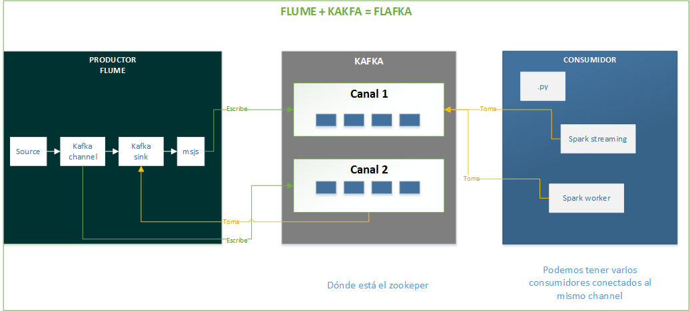

# Hadoop?? 
Es una plataforma para almacenamiento procesamiento masivo de información, osea un ch.... guero de datos....

Para empezar descarguemos la imagen del docker (estamos utilizando una imagen con la distro de Cloudera)
```shell
$ docker pull nanounanue/hadoop-pseudo
```

Ejecutamos el contenedor
```shell
$ docker run -ti --name hadoop-pseudo \
  -v /home/hatshex/proyectos/dpa/data-product-architecture/alumnos/hatshex/flume/data/:/home/itam/data \
  -p 2122:2122 -p 2181:2181 -p 39534:39534 -p 9000:9000 \
  -p 50070:50070 -p 50010:50010 -p 50020:50020 -p 50075:50075 \
  -p 50090:50090 -p 8030:8030 -p 8031:8031 -p 8032:8032 \
  -p 8033:8033 -p 8088:8088 -p 8040:8040 -p 8042:8042 \
  -p 13562:13562 -p 47784:47784 -p 10020:10020 -p 19888:19888 \
  -p 8000:8000 -p 9999:9999 \
nanounanue/docker-hadoop
```

Si ya existe solamente
```shell
docker start -ai hadoop-pseudo
```
Hadoop tiene un sistema de archivos llamado HDFS donde se almacena la información, para acceder por línea de comandos..
- Ayuda: 
```shell
hadoop fs -help
```

** Línea de comandos

```shell
hadoop fs -cmd <args>
hadoop fs -ls
hadoop fs -mkdir
hadoop fs -copyFromLocal
hadoop fs -copyToLocal
hadoop fs -put archivo archivo_hdfs
hadoop fs -get archivo_hdfs
hadoop fs -cat archivo_hdfs
hadoop fs -cat archivo_hdfs head
hadoop fs -tail archivo_hdfs
hadoop fs -rm archivo_hdfs

```

Ejecutar impala o hive (para que la gente investigue en el dataset sin ser científico de datos).
```shell
impala-shell
```
# Flume
Una vez que iniciamos el contenedor, nos firmamos con el usuario itam
```shell
$ sudo su itam
```
Vamos a la carpeta de data y creamos la carpeta ingesta
A partir de la versión 1.6 ya tiene la librería para conectarse con Twitter

Las librerías se encuentran en:
```shell
/usr/lib/kite
/usr/lib/flume-ng

sudo ln -s /usr/lib/kite/kite-morphlines-* /usr/lib/flume-ng/lib
sudo ln -s /usr/lib/kite/lib/metrics* /usr/lib/flume-ng/lib
sudo ln -s /usr/lib/kite/lib/config-1.0.2.jar /usr/lib/flume-ng/lib
sudo ln -s /usr/lib/kite/lib/Saxon-HE-9.5.1-5.jar /usr/lib/flume-ng/lib
sudo ln -s /usr/lib/kite/lib/tika-* /usr/lib/flume-ng/lib
```


